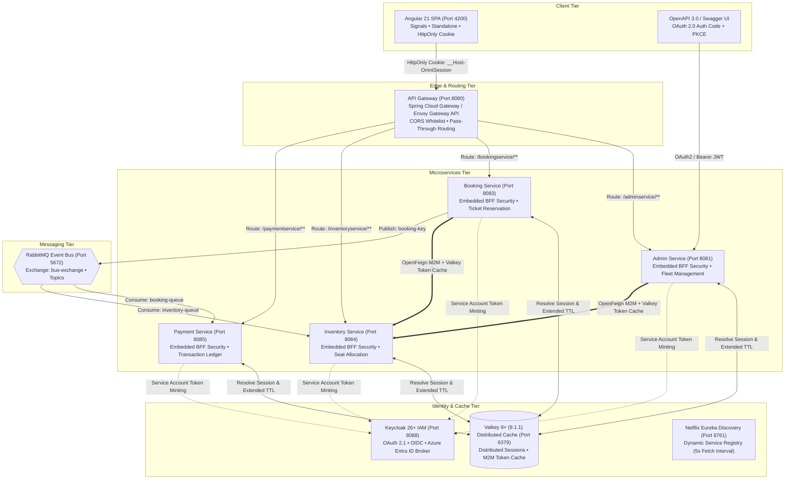
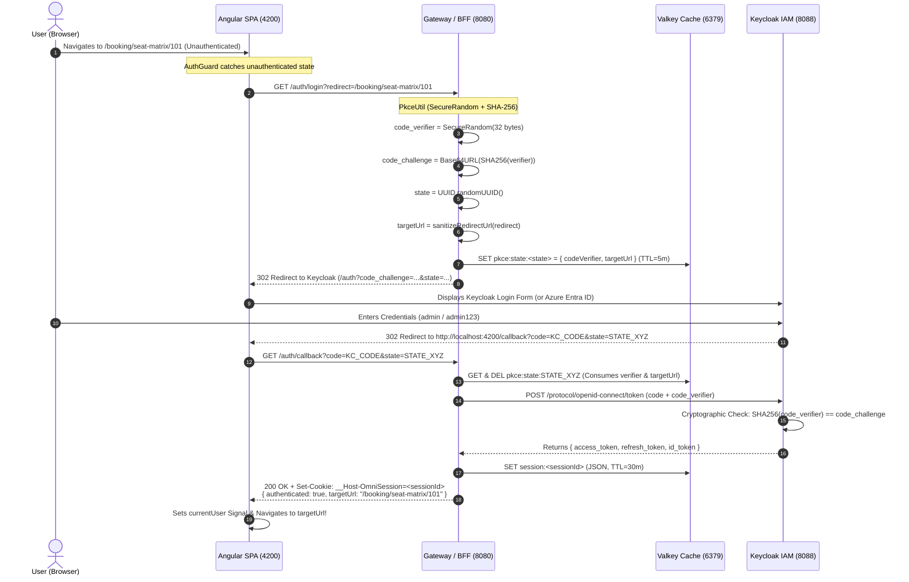
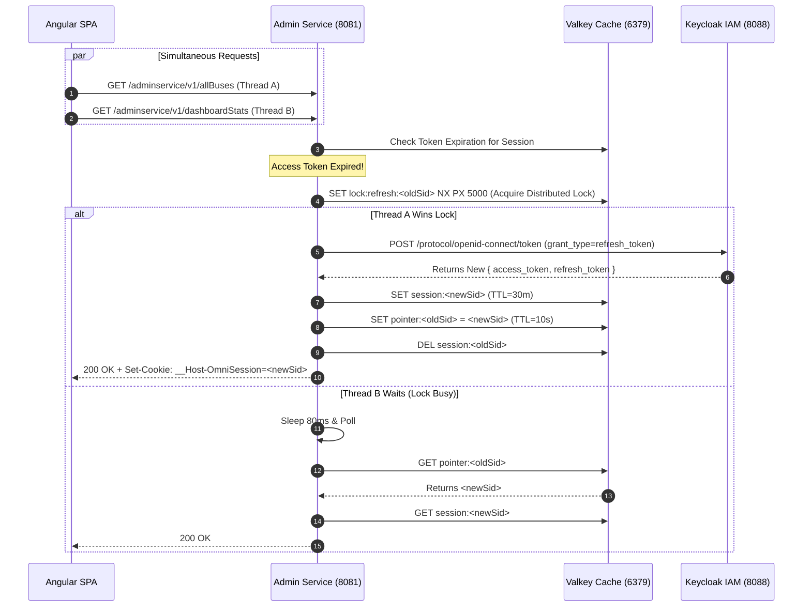

# 🚌 OmniBus Cloud-Native Enterprise Platform
## Developer & Architecture Engineering Guide

> **Version**: 2.0.0 (Production-Grade Zero-Trust Architecture)  
> **Target Audience**: Backend Engineers, Frontend Engineers, Cloud & DevOps Architects  
> **Technologies**: Java 21 LTS, Spring Boot 3.5.16, Spring Cloud 2025.0.3, Keycloak 26+, Valkey 9+ (9.1.1 Redis OSS), RabbitMQ, Netflix Eureka, Angular 21 (Signals & Standalone), Kubernetes Gateway API / Envoy.  
> **Security Standards Whitepaper**: 🛡️ [`SECURITY_STANDARDS_COMPLIANCE.md`](SECURITY_STANDARDS_COMPLIANCE.md) (OWASP Top 10 2021, OWASP API Top 10 2023, RFC 7636 PKCE, NIST SP 800-63B).

---

## 📑 Table of Contents

1. [Executive Architecture Overview](#1-executive-architecture-overview)
2. [Security & Zero-Trust Architecture](#2-security--zero-trust-architecture)
3. [Decentralized Embedded BFF Pattern & Valkey Caching](#3-decentralized-embedded-bff-pattern--valkey-caching)
4. [Keycloak Architecture, Configuration & Best Practices](#4-keycloak-architecture-configuration--best-practices)
5. [End-to-End Authentication Workflows](#5-end-to-end-authentication-workflows)
6. [Microservice-to-Microservice (M2M) Security](#6-microservice-to-microservice-m2m-security)
7. [OpenAPI 3.0 & Swagger UI Security](#7-openapi-30--swagger-ui-security)
8. [Kubernetes Gateway API & Edge Ingress Hardening](#8-kubernetes-gateway-api--edge-ingress-hardening)
9. [Resilience, Retry & Circuit Breakers](#9-resilience-retry--circuit-breakers)
10. [Event-Driven Saga Choreography (RabbitMQ)](#10-event-driven-saga-choreography-rabbitmq)
11. [Distributed Concurrency & Seat Locking (Valkey)](#11-distributed-concurrency--seat-locking-valkey)
12. [Frontend Architecture (Angular 21)](#12-frontend-architecture-angular-21)
13. [Microservices Port & Endpoint Reference Matrix](#13-microservices-port--endpoint-reference-matrix)
14. [Local Development & Startup Guide](#14-local-development--startup-guide)
15. [Production Hardening Checklist](#15-production-hardening-checklist)
16. [Enterprise Maintenance & Disaster Recovery](#16-enterprise-maintenance--disaster-recovery)

---

## 1. Executive Architecture Overview

The **OmniBus Enterprise Platform** is a resilient, distributed bus reservation and fleet management system built with cloud-native microservices, decentralized identity validation, asynchronous event streaming, and reactive edge routing.

### 🏛️ High-Level System Architecture



---

## 2. Security & Zero-Trust Architecture

### 🛡️ Why Single-Page Apps (SPA) Must NOT Store Raw JWTs
In modern zero-trust architecture, **storing access tokens in `localStorage`, `sessionStorage`, or JavaScript memory is strictly prohibited**:
* **XSS Vulnerability**: Any cross-site scripting flaw (e.g., via a compromised npm package or inline script injection) allows malicious JavaScript to read `localStorage` and exfiltrate long-lived tokens to an attacker's server.
* **Token Replay Attacks**: Once a raw JWT is stolen from browser storage, it can be replayed from anywhere in the world until expiration.

### 🔒 The Opaque Session Cookie Defense
To solve this, OmniBus implements the **Backend-For-Frontend (BFF)** pattern with hardened cookies:

```
Set-Cookie: __Host-OmniSession=8f3c7b2a-19d4-4a2e-b68e-9d2110c73e8f;
            Path=/;
            Secure;
            HttpOnly;
            SameSite=Lax;
            Max-Age=1800
```

* **`HttpOnly`**: JavaScript cannot read `document.cookie`, completely neutralizing XSS token exfiltration.
* **`__Host-` Prefix**: Enforces that the cookie can only be set from the exact origin over HTTPS and cannot be overwritten by subdomains.
* **`SameSite=Lax`**: Protects against Cross-Site Request Forgery (CSRF) on cross-origin POST/PUT calls.
* **`X-Requested-With: XMLHttpRequest`**: Angular interceptor adds this custom header. Browsers never send custom headers cross-origin without an explicit CORS preflight response.

---

## 3. Decentralized Embedded BFF Pattern & Valkey Caching

### 🆚 Architectural Comparison

| Dimension | ❌ Centralized Gateway BFF | 🏆 Decentralized Embedded BFF (OmniBus) |
| :--- | :--- | :--- |
| **Session Translation Point** | Edge Gateway translates Cookie $\rightarrow$ JWT for every single request. | Each Microservice embeds `common-security` and reads session directly from Valkey. |
| **Gateway Throughput** | Heavy CPU bottleneck: Gateway parses, deserializes, refreshes tokens on 100% of traffic. | Ultra-high performance: Gateway is a lightweight pass-through router. |
| **Failure Blast Radius** | If Gateway auth module fails, all internal and external communication collapses. | Microservices are resilient and validate sessions independently. |
| **Cloud-Native Ingress** | Impossible to replace Gateway with Envoy or Kubernetes Gateway API. | Gateway can be seamlessly swapped with standard **Kubernetes Gateway API / Envoy Proxy**. |

### 💾 Valkey Session Record Schema (`SessionRecord.java`)

```json
{
  "sessionId": "8f3c7b2a-19d4-4a2e-b68e-9d2110c73e8f",
  "accessToken": "eyJhbGciOiJSUzI1NiIs...",
  "refreshToken": "eyJhbGciOiJIUzUxMiIs...",
  "accessTokenExpiresAt": "2026-08-17T06:30:00Z",
  "lastValidatedAt": "2026-08-17T06:25:30Z",
  "username": "admin",
  "roles": ["ROLE_ADMIN", "ROLE_USER"],
  "language": "en",
  "timezone": "Asia/Kolkata",
  "homepage": "/admin",
  "theme": "dark",
  "clientFingerprint": "192.168.1.50"
}
```

### ⚡ Valkey Key Topology & Lifecycle

```
┌──────────────────────────────────────┬─────────────┬────────────────────────────────────────────────────────┐
│ Key Pattern                          │ Default TTL │ Purpose                                                │
├──────────────────────────────────────┼─────────────┼────────────────────────────────────────────────────────┤
│ `session:<sessionId>`                │ 30 Minutes  │ Active user session holding Keycloak tokens & roles.   │
│ `pointer:<oldSessionId>`             │ 10 Seconds  │ In-flight rotation pointer to prevent race conditions. │
│ `lock:refresh:<oldSessionId>`        │ 5 Seconds   │ Distributed Mutex for single-thread token renewal.     │
│ `lock:validate:<sessionId>`          │ 4 Seconds   │ Distributed Mutex for periodic Keycloak introspection. │
│ `passport:key:<appName>:current`     │ 30 Seconds  │ Active rotating HMAC-SHA256 key for OpenFeign mesh.    │
│ `passport:key:<appName>:previous`    │ 10 Seconds  │ Grace overlap HMAC key for in-flight Feign calls.      │
│ `lock:passport:rotate:<appName>`     │ 4 Seconds   │ Distributed Mutex for single-pod key rotation.         │
│ `revoked_archive:<sessionId>`        │ 1 Hour      │ Audit log of rotated sessions for hijack detection.    │
└──────────────────────────────────────┴─────────────┴────────────────────────────────────────────────────────┘
```

### 🔄 Periodic Keycloak Validation with Distributed Double-Checked Locking (DCL)
To guarantee real-time detection of tokens revoked in Keycloak without overwhelming the auth server:
1. **Fast Path (< 30s)**: Reads `session:<sessionId>` from Valkey in **< 1ms** with zero network calls to Keycloak.
2. **Stale Path (> 30s)**:
   - **Lock Winner**: Acquires `lock:validate:<sessionId>` in Valkey (`SET lock:validate:<sid> <uuid> NX EX 4`).
   - Verifies the access token against cached Keycloak JWKS and checks expiration.
   - If active: updates `lastValidatedAt = now()` in Valkey and releases the lock.
   - If inactive: attempts silent auto-healing with `refresh_token`. If refresh fails (session revoked by admin), deletes `session:<sessionId>` from Valkey and records a revocation archive.
   - **Lock Waiters (Double-Checked Locking)**: Concurrent requests wait 50ms for lock release and re-read Valkey. If the session was purged by the winner, they immediately return `401 Unauthorized`. Thundering herds are completely eliminated.

### 🛡️ Dual-Channel Ingress Authentication
- **Channel 1 (Web Browsers)**: Uses the hardened `__Host-OmniSession` HttpOnly cookie, resolved via Valkey.
- **Channel 2 (AI Agents, APIs, M2M, Swagger)**: Uses standard `Authorization: Bearer <jwt>`. Cryptographically verified using cached **Keycloak JWKS RS256** signatures (`/protocol/openid-connect/certs`) and verified against `exp` (expiry) and `iss` (issuer).
- Both channels converge cleanly into Spring's `SecurityContextHolder` with `@PreAuthorize` role enforcement.

---

## 4. Keycloak Architecture, Configuration & Best Practices

Keycloak 26+ serves as the centralized OpenID Connect (OIDC) & OAuth 2.1 Identity Provider (IdP) for the OmniBus platform.

### 🏛️ Realm & Role Architecture (`bus-reservation`)

* **Isolated Realm**: Workloads run inside a dedicated `bus-reservation` realm, completely decoupled from Keycloak's `master` admin realm.
* **Role Hierarchy**:
  * `ADMIN` / `ROLE_ADMIN`: Administrative operations (coach creation, fleet pricing, inventory initialization, Prometheus metrics).
  * `USER` / `ROLE_USER`: Standard passenger privileges (route searching, seat booking, ticket viewing/cancellation).
* **Clean Role Mappings**: Keycloak defines clean business roles (`ADMIN`, `USER`). Downstream microservices (`common-security`) dynamically map them to Spring Security `ROLE_ADMIN` and `ROLE_USER` for `@PreAuthorize("hasRole('ADMIN')")` evaluation.
* **Streamlined Client Scopes**:
  * Active scopes: `openid`, `profile`, `email`, `roles`, and `web-origins`.
  * Redundant/unused scopes (`phone`, `address`, `microprofile-jwt`, `offline_access`, `organization`, `acr`) are purged from the realm to reduce token payload size and eliminate misconfiguration attack surface.
* **User Custom Preferences & Self-Service Attributes**:
  * Users declare custom attributes in Keycloak: `language` (e.g. `en`), `timezone` (e.g. `Asia/Kolkata`), `homepage` (e.g. `/booking`), and `theme` (e.g. `dark`).
  * OIDC `ProtocolMappers` inject these attributes directly into ID Tokens, UserInfo, and Access Token claims.
  * The BFF Gateway exposes `PUT /auth/user/preferences`:
    * Immediately updates the distributed Valkey session cache for sub-millisecond frontend reactivity.
    * Persists updates directly to Keycloak using the **User's Active Bearer Token** via Keycloak's standard self-service User Account API (`POST /realms/{realm}/account`) — enforcing **Strict Least Privilege** with zero admin or M2M privilege escalation.

---

### ⚙️ Client Definitions & Topology

| Client ID | Client Type | Authentication | Grant Types | Web Origins | Target Use Case |
| :--- | :---: | :---: | :---: | :---: | :--- |
| `angular-client` | Public | None (Public PKCE) | Authorization Code + PKCE | Strict Whitelist (`:4200`, `:8080`, `:8081`...) | Angular SPA & Swagger UI |

---

### 🛡️ Keycloak Security Best Practices Enforced

1. **Strict Zero-Trust (No Direct Access Grants)**:
   * Public clients have `directAccessGrantsEnabled: false`. Resource Owner Password Credentials (ROPC) grant is permanently disabled to eliminate brute-force password spraying against the token endpoint.
2. **Mandatory PKCE (RFC 7636) with SHA-256 (`S256`)**:
   * All public client authorization flows require a cryptographically random `code_verifier` and SHA-256 `code_challenge`.
3. **Zero-Trust Token Lifespans**:
   * **Access Token**: Short-lived (5 minutes / 300s) to minimize exposure in the event of memory leakage.
   * **SSO Session Idle Timeout**: 30 minutes (perfectly synchronized with Valkey's sliding window cache TTL).
   * **SSO Session Max**: 10 hours.
4. **Refresh Token Rotation (RTR)**:
   * Keycloak invalidates refresh tokens upon single use (`Revoke Refresh Token: true`), returning a brand-new refresh token on each renewal. Valkey provides a 10-second grace pointer for in-flight requests.
5. **Origin & CORS Whitelist Hardening**:
   * `webOrigins` strictly lists trusted frontend and Swagger URLs. Wildcards (`*`) with credentials are completely forbidden.
6. **Edge Ingress Token Shielding**:
   * Kubernetes Gateway API (`HTTPRoute`) isolates Keycloak's `/protocol/openid-connect/token` to internal ClusterIP. Public edge traffic is restricted to interactive UI endpoints (`/auth`, `/logout`, `/broker/`, `/resources/`).
7. **Front-Channel Interactive Logout**:
   * Logout routes through Keycloak's interactive confirmation dialog (`/protocol/openid-connect/logout?post_logout_redirect_uri=...`), providing a seamless user experience while purging local Valkey cache records.
8. **Enterprise IDP Federation Ready**:
   * Keycloak acts as an Identity Broker for corporate SAML/OIDC IDPs (Azure Active Directory / Entra ID, Okta). The `/realms/bus-reservation/broker/` redirect URI is whitelisted on the edge for Microsoft/Okta browser returns.
9. **Production Server Optimization**:
   * Keycloak container runs in optimized mode (`kc.sh start --optimized`) with PostgreSQL backing, managed connection pooling, and Infinispan distributed session clustering.
10. **Keycloak Custom Theme (`omnibus`)**:
   * **Theme Templates**:
  * `login.ftl`: Glassmorphic login card with native vector SVG CAPTCHA, 1-click refresh 🔄, and demo credentials pills.
  * `login-reset-password.ftl`: Custom themed Account Recovery / Forgot Password screen.
  * `login-update-password.ftl`: Custom themed Set / Update New Password screen with complexity badge.
  * `login-config-totp.ftl`: Custom themed MFA Two-Factor Authentication setup with QR code scanner and manual key.
  * `login-otp.ftl`: Custom themed MFA OTP 6-digit authentication verification screen.
  * `logout-confirm.ftl`: Custom themed logout confirmation screen.
  * `info.ftl`: Themed informational / status notice screen.
  * `error.ftl`: Themed authentication error & audit notice screen.
  * `resources/css/login.css`: Centralized CSS tokens & dark glassmorphism styling across all auth screens.
11. **Server-Side CAPTCHA Authenticator SPI (`keycloak-captcha-spi`) & Native Brute Force Protection**:
   * Custom `ValkeyCaptchaAuthenticator` SPI deployed to Keycloak `providers/` enforcing server-side time-bounded cryptographic HMAC CAPTCHA validation **before** checking passwords (immune to direct curl/POST bypass).
   * Keycloak Native Brute Force Protection enabled (`bruteForceProtected: true`, max 5 failed attempts $\rightarrow$ 15-minute lockout).

---

## 5. End-to-End Authentication Workflows

### 🔐 1. User Interactive Login Flow (OAuth 2.0 Auth Code + PKCE + State Deep-Linking + BFF)



#### 🛡️ The Dual Role of the `state` Parameter
1. **CSRF & Session Fixation Shield (RFC 6749 Section 10.12)**: The random UUID `state` ensures that login responses can only be completed by the client instance that initiated the request, rejecting spoofed callbacks.
2. **Deep-Linking / Target Page Preservation**: When unauthenticated users click direct deep links (e.g. `/booking/seats/42`), the target URL is stored securely in Valkey under the ephemeral `state` ID. Upon successful login, the frontend dynamically navigates to the user's intended target instead of forcing them back to the home page.
3. **Open Redirect Defense**: All redirect URLs are strictly sanitized (`sanitizeRedirectUrl`) on the backend, enforcing relative URI paths (`/`) and explicitly rejecting protocol-relative URLs (`//evil.com`) or backslashes (`\`).

---

### 🔄 2. Token Refresh & Concurrency-Safe Rotation Flow

When multiple AJAX calls hit microservices simultaneously and the access token has expired:



---

### 🚪 3. Interactive User Logout Flow

```mermaid
sequenceDiagram
    autonumber
    actor User as User (Browser)
    participant UI as Angular SPA (4200)
    participant GW as Gateway / BFF (8080)
    participant VK as Valkey Cache (6379)
    participant KC as Keycloak IAM (8088)

    User->>UI: Clicks "Logout"
    UI->>GW: GET /auth/logout
    GW->>VK: DEL session:<sessionId>
    GW->>VK: DEL pointer:<sessionId>
    GW-->>UI: Set-Cookie: __Host-OmniSession=; Max-Age=0
    GW-->>UI: 302 Redirect to Keycloak (/protocol/openid-connect/logout)
    UI->>KC: Browser opens Keycloak Logout Confirmation
    Note over KC: "Are you sure you want to log out?"
    User->>KC: Clicks "Logout"
    KC-->>UI: 302 Redirect back to http://localhost:4200/
    UI->>UI: Displays Clean Logged-Out Home Page
```

---

## 6. Microservice-to-Microservice (M2M) Security

When `BookingService` needs to check seat availability or reserve capacity in `InventoryService`, it makes an internal synchronous HTTP call via **OpenFeign**.

```
[ BookingService ] ──(OpenFeign + M2M Interceptor)──> [ InventoryService ]
        │                                                     │
        ▼                                                     ▼
 1. FeignPassportRequestInterceptor mints              1. BffSessionAuthenticationFilter
    X-Internal-Passport (Signed HMAC-SHA256)              extracts X-Internal-Passport & X-Passport-User
 2. Injects X-Passport-User: <username>                2. Fetches caller app key from Valkey
 3. Dispatches HTTP call via ClusterIP                 3. Validates HMAC signature (< 5 microseconds)
                                                       4. Populates SecurityContextHolder
```

### ⚙️ Caller-App Aware Ephemeral Valkey Passport (`PassportManager.java`)

Instead of making slow, synchronous roundtrips to Keycloak or storing static secrets across microservices, inter-service Feign calls use **ephemeral symmetric HMAC keys rotated in Valkey every 30 seconds with a 10-second grace overlap window**:

* **Valkey Keys**:
  * `passport:key:<callerAppName>:current` (30s TTL)
  * `passport:key:<callerAppName>:previous` (10s Grace Window)
  * `lock:passport:rotate:<callerAppName>` (Distributed Mutex)
* **Dual-Header Verification**:
  1. `X-Passport-User: <username>`
  2. `X-Internal-Passport: <HMAC-SHA256 JWT>` (Contains `iss: <caller_app_name>`, `sub: <username>`, `roles: [...]`)

### 💻 OpenFeign Request Interceptor (`FeignPassportRequestInterceptor.java`)

The Feign interceptor automatically propagates user context and mints the signed passport without developer boilerplate:

```java
@Configuration
@ConditionalOnClass(RequestInterceptor.class)
public class FeignPassportRequestInterceptor implements RequestInterceptor {

    private final PassportManager passportManager;

    @Value("${spring.application.name:unknown-service}")
    private String appName;

    public FeignPassportRequestInterceptor(PassportManager passportManager) {
        this.passportManager = passportManager;
    }

    @Override
    public void apply(RequestTemplate template) {
        Authentication auth = SecurityContextHolder.getContext().getAuthentication();

        String username = (auth != null && auth.getName() != null) ? auth.getName() : "system_service";
        List<String> roles = (auth != null && auth.getAuthorities() != null)
                ? auth.getAuthorities().stream().map(GrantedAuthority::getAuthority).collect(Collectors.toList())
                : List.of("ROLE_USER");

        try {
            String passportToken = passportManager.mintPassport(appName, username, roles);
            template.header(PassportManager.PASSPORT_HEADER, passportToken);
            template.header(PassportManager.PASSPORT_USER_HEADER, username);
        } catch (Exception e) {
            log.error("Failed to attach internal passport on Feign call: {}", e.getMessage());
        }
    }
}
```

---

## 7. OpenAPI 3.0 & Swagger UI Security

Swagger UI integrates with Keycloak using **OAuth 2.0 Authorization Code Flow + PKCE** and **Direct Bearer Token**:

```java
@Configuration
@ConditionalOnClass(OpenAPI.class)
public class OpenApiSecurityConfig {

    @Value("${keycloak.auth-server-url:http://localhost:8088}")
    private String keycloakUrl;

    @Value("${keycloak.realm:bus-reservation}")
    private String realm;

    @Bean
    public OpenAPI customOpenAPI() {
        String authUrl = String.format("%s/realms/%s/protocol/openid-connect/auth", keycloakUrl, realm);
        String tokenUrl = String.format("%s/realms/%s/protocol/openid-connect/token", keycloakUrl, realm);

        return new OpenAPI()
                .info(new Info()
                        .title("OmniBus Cloud-Native Microservices API")
                        .version("2.0.0")
                        .description("Production-Grade OAuth 2.0 Auth Code + PKCE & Embedded BFF"))
                .addSecurityItem(new SecurityRequirement()
                        .addList("Keycloak_OAuth2")
                        .addList("Bearer_Token"))
                .components(new Components()
                        .addSecuritySchemes("Keycloak_OAuth2", new SecurityScheme()
                                .type(SecurityScheme.Type.OAUTH2)
                                .description("Log in with Keycloak (admin/admin123 or john_doe/user123) via Auth Code + PKCE")
                                .flows(new OAuthFlows()
                                        .authorizationCode(new OAuthFlow()
                                                .authorizationUrl(authUrl)
                                                .tokenUrl(tokenUrl)
                                                .scopes(new Scopes()
                                                        .addString("openid", "OpenID Connect")
                                                        .addString("profile", "User Profile")
                                                        .addString("roles", "User Roles")))))
                        .addSecuritySchemes("Bearer_Token", new SecurityScheme()
                                .type(SecurityScheme.Type.HTTP)
                                .scheme("bearer")
                                .bearerFormat("JWT")
                                .description("Direct JWT Bearer Token")));
    }
}
```

---

## 8. Kubernetes Gateway API & Edge Ingress Hardening

OmniBus uses the modern **Kubernetes Gateway API (`gateway.networking.k8s.io/v1`)** to manage edge routing, TLS termination, and CORS policies.

```
📁 envoy/
├── 📄 gatewayclass.yaml     (Standard Envoy GatewayClass controller)
├── 📄 gateway.yaml          (Port 80 HTTP / 443 HTTPS Gateway with TLS termination)
├── 📄 httproute.yaml        (Declarative PathPrefix routing with strict Keycloak whitelisting)
└── 📄 security-policy.yaml  (Envoy Gateway SecurityPolicy for CORS & trusted headers)
```

### 🔒 HTTPRoute Manifest (`envoy/httproute.yaml`)
```yaml
apiVersion: gateway.networking.k8s.io/v1
kind: HTTPRoute
metadata:
  name: omnibus-http-routes
  namespace: default
spec:
  parentRefs:
    - name: omnibus-gateway
      namespace: default
  rules:
    # 1. Admin Service
    - matches:
        - path: { type: PathPrefix, value: /adminservice/ }
      backendRefs:
        - name: adminservice
          port: 8081

    # 2. Booking Service
    - matches:
        - path: { type: PathPrefix, value: /bookingservice/ }
      backendRefs:
        - name: bookingservice
          port: 8083

    # 3. Inventory Service
    - matches:
        - path: { type: PathPrefix, value: /inventoryservice/ }
      backendRefs:
        - name: inventoryservice
          port: 8084

    # 4. Payment Service
    - matches:
        - path: { type: PathPrefix, value: /paymentservice/ }
      backendRefs:
        - name: paymentservice
          port: 8085

    # 5. Keycloak Application Realm & Theme Resources
    # Exclusively exposes the 'bus-reservation' realm (Discovery, JWKS, PKCE Token, Login).
    # Master realm and /admin console remain 100% blocked from the edge for security.
    - matches:
        - path: { type: PathPrefix, value: /realms/bus-reservation/ }
        - path: { type: PathPrefix, value: /resources/ }
      backendRefs:
        - name: keycloak
          port: 8080

    # 6. Default Frontend UI
    - matches:
        - path: { type: PathPrefix, value: / }
      backendRefs:
        - name: frontend
          port: 80
```

### 🤖 Envoy AI Gateway — Model Context Protocol (MCP) (`aigateway.envoyproxy.io/v1alpha1`)

OmniBus integrates with the official **[Envoy AI Gateway](https://aigateway.envoyproxy.io/docs/api/)** specification using the `MCPRoute` Custom Resource Definition to aggregate multi-service Spring AI MCP backends into a unified edge endpoint (`/mcp`):

```yaml
apiVersion: aigateway.envoyproxy.io/v1alpha1
kind: MCPRoute
metadata:
  name: omnibus-mcp-route
  namespace: default
spec:
  parentRefs:
    - name: omnibus-gateway
  path: /mcp
  backendRefs:
    - name: adminservice
      port: 8081
      path: /mcp/admin
    - name: bookingservice
      port: 8083
      path: /mcp/booking
    - name: inventoryservice
      port: 8084
      path: /mcp/inventory
```

* **Unified LLM Ingress**: External AI assistants (Claude Desktop, Cursor, LangChain agents) connect to a single endpoint (`https://api.omnibus.com/mcp`).
* **Declarative Aggregation**: Envoy AI Gateway automatically aggregates tool manifests and routes execution requests to `adminservice`, `bookingservice`, and `inventoryservice`.

* **Module**: [`keycloak-captcha-spi`](file:///c:/Personal-Project/microservice-main/microservice-main/keycloak-captcha-spi/) (`ValkeyCaptchaAuthenticator.java` & `ValkeyClient.java`)
* **Multi-Instance / Cluster Synchronization**:
  * **Valkey Cluster Secret Sync**: The cluster-wide rotating HMAC secret is shared across all Keycloak instances via Valkey (`keycloak:captcha:cluster_secret`) or external environment variable `KEYCLOAK_CAPTCHA_SECRET`. Any Keycloak instance can generate a challenge, and any other instance can validate it.
  * **Distributed Single-Use Replay Protection**: Token signatures are atomically recorded in Valkey upon submission (`SET captcha:used:<sig> 1 EX 120 NX`), ensuring an attacker cannot replay a captured CAPTCHA token to bypass verification on another pod.
  * **Zero-Downtime Resilience**: If Valkey is temporarily unreachable, Keycloak seamlessly falls back to the deterministic cluster HMAC signature with timestamp validation.
* **100% Server Enforced**: Runs inside Keycloak's server-side authentication pipeline before credentials are evaluated. Direct API/curl POST attacks cannot bypass verification.

### 🚦 Kubernetes Gateway API / Envoy Rate Limiting ([`envoy/ratelimit-policy.yaml`](file:///c:/Personal-Project/microservice-main/microservice-main/envoy/ratelimit-policy.yaml))
Rate limiting is enforced at the Kubernetes ingress edge using declarative `RateLimitPolicy` (without baking restrictive, hard-to-migrate logic into application microservice code):

```yaml
apiVersion: gateway.envoyproxy.io/v1alpha1
kind: RateLimitPolicy
metadata:
  name: omnibus-rate-limit-policy
  namespace: default
spec:
  targetRefs:
    - group: gateway.networking.k8s.io
      kind: HTTPRoute
      name: omnibus-http-routes
  global:
    rules:
      # 1. Protection on CAPTCHA Generation (Anti-Scraping / Anti-Flooding)
      - clientSelectors:
          - headers:
              - name: ":path"
                value: "^/auth/captcha.*"
                type: RegularExpression
        limit:
          requests: 15
          unit: Minute
      # 2. Protection on Direct Login (Anti-Brute Force / Anti-Credential Stuffing)
      - clientSelectors:
          - headers:
              - name: ":path"
                value: "^/auth/login.*"
                type: RegularExpression
        limit:
          requests: 5
          unit: Minute
```

---

## 9. Resilience, Retry & Circuit Breakers

Microservices protect themselves from cascading downstream failures using **Resilience4j**:

```java
@PostMapping("/bookSeat")
@Retry(name = "seatsCheckRetry", fallbackMethod = "bookingFallback")
@CircuitBreaker(name = "seatsCheckCB", fallbackMethod = "bookingFallback")
public ResponseEntity<BookingModel> bookSeat(...) {
    // Synchronous Feign call to InventoryService
    Integer availableSeats = inventoryClient.getSeatAvailability(source, destination, requiredSeats);
    ...
}

public ResponseEntity<BookingModel> bookingFallback(Exception ex) {
    log.error("Circuit breaker triggered for seat booking: {}", ex.getMessage());
    BookingModel fallback = new BookingModel();
    fallback.setStatus("TEMPORARILY_UNAVAILABLE");
    return ResponseEntity.status(HttpStatus.SERVICE_UNAVAILABLE).body(fallback);
}
```

---

## 10. Event-Driven Messaging & RabbitMQ Architecture

```
                                 [ RABBITMQ TOPOLOGY ]
                                 
                     ┌─────────────────────────────────────────┐
                     │          Topic Exchange:                │
                     │          "bus-exchange"                 │
                     └─────────────────────────────────────────┘
                                   │              │
                    "booking-key"  │              │  "payment-key"
                                   ▼              ▼
                     ┌──────────────────┐   ┌──────────────────┐
                     │ "booking-queue"  │   │ "payment-queue"  │
                     │ (PaymentService) │   │(InventoryService)│
                     └──────────────────┘   └──────────────────┘
```

* **Decoupled Transactions**: When a booking is created, `BookingService` publishes a JSON payload to `bus-exchange`. `PaymentService` asynchronously consumes `booking-queue` to initiate billing.
* **Dead Letter Exchanges (DLX)**: Failed messages after 3 retry attempts are automatically routed to `bus-dead-letter-exchange` for operator investigation.

---

## 11. Service Discovery & HealthCheck-Bound Fast Synchronization

To eliminate premature routing and `503 Service Unavailable` errors during service startup or restarts, OmniBus enforces **HealthCheck-Bound Registration** and **sub-second cache synchronization**:

### 🛡️ 1. HealthCheck-Bound Registration (`STARTING` $\rightarrow$ `UP`)
* **Initial Status**: Microservices register with `eureka.instance.initial-status=STARTING`. Eureka blocks ingress traffic while Spring Boot binds ports and verifies database connection pools.
* **Actuator HealthCheck Binding**: `eureka.client.healthcheck.enabled=true` binds Eureka status directly to Spring Boot Actuator (`/actuator/health`). Only when Actuator reports `{"status":"UP"}` does Eureka flip the instance to `UP`.

```properties
# Microservices Configuration (common-application.properties)
eureka.client.service-url.defaultZone=http://localhost:8761/eureka/
eureka.client.register-with-eureka=true
eureka.client.fetch-registry=true
eureka.client.healthcheck.enabled=true
eureka.client.registry-fetch-interval-seconds=3
eureka.instance.prefer-ip-address=true
eureka.instance.initial-status=STARTING
eureka.instance.lease-renewal-interval-in-seconds=3
eureka.instance.lease-expiration-duration-in-seconds=6
```

### ⚡ 2. Eureka Server Sub-Second Cache Eviction (`service-registry`)
```properties
eureka.server.response-cache-update-interval-ms=1000
eureka.server.eviction-interval-timer-in-ms=2000
eureka.server.enable-self-preservation=false
```

### 🔄 3. Gateway Responsive Load Balancer Cache (`gateway`)
```yaml
spring:
  cloud:
    loadbalancer:
      cache:
        ttl: 2s            # Evicts dead/stale instance pointers every 2 seconds
        capacity: 256
eureka:
  client:
    healthcheck:
      enabled: true
    registry-fetch-interval-seconds: 2
  instance:
    initial-status: STARTING
```

---

## 12. Frontend Architecture (Angular 21)

### 🅰️ Standalone Architecture, Signals & Zoneless Rendering
* **TypeScript 7.0.2**: Powered by modern TypeScript with Go-based fast native compilation.
* **100% Zoneless (`provideExperimentalZonelessChangeDetection`)**: Completely removes legacy `zone.js` runtime overhead and polyfills, reducing bundle size by ~90 KB and boosting micro-task execution speeds.
* **Reactive Signals State**: Uses `signal()`, `computed()`, and `effect()` for atomic, fine-grained DOM updates without zone-based full component tree polling.
* **No `localStorage`**: User authentication state (`currentUser`) is stored in an ephemeral in-memory Signal hydrated via `/auth/user`.

### 🛡️ Angular Login Interceptor (`login.interceptor.ts`)
```typescript
export const loginInterceptor: HttpInterceptorFn = (req, next) => {
  const userService = inject(UserService);

  // Decentralized Embedded BFF Architecture: Browser NEVER attaches Bearer tokens in JS.
  // The opaque HttpOnly cookie (__Host-OmniSession) is sent automatically with withCredentials: true.
  // Each target microservice's BffSessionAuthenticationFilter resolves the session directly from Valkey.
  // X-Requested-With header provides CSRF defense-in-depth (browsers never auto-send custom headers cross-origin).
  const authReq = req.clone({
    withCredentials: true,
    setHeaders: {
      'X-Requested-With': 'XMLHttpRequest'
    }
  });

  return next(authReq).pipe(
    catchError((error: HttpErrorResponse) => {
      if ((error.status === 401 || error.status === 403) && !req.url.includes('/auth/')) {
        console.warn('Session expired or unauthorized - redirecting to BFF Login');
        userService.loginWithKeycloak();
      }
      return throwError(() => error);
    })
  );
};
```

---

## 13. Microservices Port & Endpoint Reference Matrix

| Service | Port | Base Path | Core Endpoints & Responsibilities |
| :--- | :--- | :--- | :--- |
| **API Gateway** | `8080` | `/` | 100% Pure Ingress Routing (`/adminservice/**`, `/bookingservice/**`, `/auth/**`, `/**`) |
| **Admin Service** | `8081` | `/adminservice/v1` | `/addBusDetails`, `/allBuses`, `/dashboardStats`, `/findBusDetailsByNumber`, `/auth/**` |
| **Booking Service**| `8083` | `/bookingservice/v1`| `/bookSeat`, `/getBookingHistory`, `/cancelBooking` |
| **Inventory Service**| `8084`| `/inventoryservice/v1`| `/seatAvailability`, `/reserveSeat`, `/releaseSeat` |
| **Payment Service** | `8085` | `/paymentservice/v1`| `/processPayment`, `/paymentStatus`, `/refundPayment` |
| **Keycloak IAM** | `8088` | `/realms/bus-reservation` | OAuth 2.1 Identity Provider, Azure Entra ID Broker, Token Minting |
| **Netflix Eureka** | `8761` | `/eureka` | Service Discovery & Registration Registry |
| **Valkey OSS** | `6379` | `localhost:6379` | Distributed Session Store & M2M Token Cache |
| **RabbitMQ** | `5672` | `localhost:5672` | Event Streaming Broker (Management UI: `15672`) |
| **Angular Frontend**| `4200` | `/` | Customer Reservation UI, Admin Fleet Portal, `/login` & `/logout` |

---

## 14. Local Development & Startup Guide

### 📋 Prerequisites
* **Java 21+ LTS (JDK)** installed and on PATH.
* **Node.js 20+** & npm installed.
* **Podman** or **Docker Desktop** installed and running.

### 📦 Centralized Multi-Module Build (All Microservices)
Thanks to the centralized root parent POM (`omnibus-parent`), the entire microservices platform compiles and packages in a single command from the repository root:

```bash
mvn clean install -DskipTests
```

This automatically builds all 8 modules in optimal topological reactor order (`omnibus-parent` -> `common-security` -> `service-registry` -> `gateway` -> `adminservice` -> `bookingservice` -> `inventoryservice` -> `paymentservice`).

### ⚙️ Centralized Common Properties (`common-application.properties`)
Just like dependencies are centrally managed in `pom.xml`, shared infrastructure configurations (Eureka, Valkey/Redis, Keycloak IAM, Swagger UI OAuth, RabbitMQ, and Actuator) are centralized in [`common-security/src/main/resources/common-application.properties`](file:///c:/Personal-Project/microservice-main/microservice-main/common-security/src/main/resources/common-application.properties).

Each microservice imports the shared base with a single line:
```properties
spring.config.import=classpath:common-application.properties
```
This eliminates property duplication across services while allowing individual microservices to override or add service-specific properties (e.g. `server.port`, `spring.application.name`, and database connection strings).

### 🚀 Starting the Stack
Run the automated Windows batch script:
```powershell
.\start-all.bat
```
*(Or on Linux/macOS: `./start-all.sh`)*

### 🛑 Stopping the Stack
```powershell
.\stop-all.bat
```

### 👤 Default Test Accounts (Keycloak)
* **Administrator**: `admin` / `admin123` (Roles: `ROLE_ADMIN`, `ROLE_USER`)
* **Customer User**: `john_doe` / `user123` (Roles: `ROLE_USER`)

---

## 15. Production Hardening Checklist

- [x] **CORS Centralization**: Removed wildcard `@CrossOrigin` from controllers; strictly managed via Gateway `globalcors`.
- [x] **Actuator Lockdown**: Restricted sensitive endpoints (`/env`, `/heapdump`); public access limited to `/health`, `/info`, `/prometheus`.
- [x] **Dynamic HTTPS Cookies**: Automatic `secure: true` when accessed over HTTPS or behind reverse proxies (`X-Forwarded-Proto`).
- [x] **Externalized Secrets**: All Keycloak secrets use environment variable overrides (`${KEYCLOAK_INTERNAL_SECRET}`).
- [x] **RFC 7807 Error Handling**: Centralized `GlobalExceptionHandler` returning structured problem details JSON.
- [x] **Valkey Memory Eviction**: 4-tier lifecycle guarantee ensuring zero memory leaks.
- [x] **Edge Route Whitelisting**: Kubernetes `HTTPRoute` blocks public access to `/protocol/openid-connect/token`.

---

## 16. Enterprise Security & Architecture FAQ

<details>
<summary><strong>Q1: Why is storing JWTs in localStorage an anti-pattern?</strong></summary>

Any Cross-Site Scripting (XSS) vulnerability allows malicious JavaScript to read `localStorage` and transmit tokens to an external attacker. HttpOnly cookies cannot be read by JavaScript under any circumstances.
</details>

<details>
<summary><strong>Q2: Why Decentralized Embedded BFF instead of Gateway Token Relay?</strong></summary>

Gateway Token Relay forces the Gateway to parse, deserialize, and translate every single HTTP request, creating a massive CPU bottleneck and single point of failure. Decentralized Embedded BFF allows the Gateway to be a high-performance pass-through router while microservices validate sessions directly against Valkey in sub-milliseconds.
</details>

<details>
<summary><strong>Q3: How are session tokens protected from XSS and CSRF?</strong></summary>

* **XSS**: Blocked by `HttpOnly` cookie flags and CSP headers.
* **CSRF**: Blocked by `SameSite=Lax` cookie flags and the mandatory `X-Requested-With: XMLHttpRequest` custom header.
</details>

<details>
<summary><strong>Q4: Why does the Gateway have <code>/auth/**</code> endpoints if microservices embed the BFF?</strong></summary>

The browser needs an OAuth client endpoint to exchange Keycloak authorization codes for tokens and set the initial HttpOnly cookie. The Gateway acts as the auth orchestrator at login, but is 100% pass-through for business traffic.
</details>

<details>
<summary><strong>Q5: What happens when an access token expires while a user is active?</strong></summary>

The microservice's `BffSessionAuthenticationFilter` detects the expired token, acquires a Valkey distributed mutex (`SET NX PX 5000`), refreshes tokens at Keycloak, rotates the session, and updates the cookie on the HTTP response.
</details>

<details>
<summary><strong>Q6: How do we prevent token refresh race conditions on concurrent requests?</strong></summary>

The winning thread rotates the session and writes a 10-second forwarding pointer (`pointer:<oldSid> -> <newSid>`). Sibling threads detect the lock, follow the pointer, and succeed without any dropped requests.
</details>

<details>
<summary><strong>Q7: How is inter-service communication secured (OpenFeign)?</strong></summary>

`FeignPassportRequestInterceptor` mints an ephemeral HMAC-SHA256 token (`X-Internal-Passport`) alongside `X-Passport-User`. Receiving microservices verify the signature in **< 5 microseconds** against 30s rotating symmetric keys in Valkey (`passport:key:<appName>:current`).
</details>

<details>
<summary><strong>Q8: Why Ephemeral Valkey Passports instead of static Keycloak Client Secrets?</strong></summary>

* **Zero Keycloak Mesh Bottleneck**: 0 network hops to Keycloak during inter-service hops.
* **No Secret Sprawl**: Symmetric HMAC keys are dynamically generated, auto-rotated in Valkey every 30 seconds with a 10s grace overlap, eliminating shared static passwords.
* **Sub-Microsecond Verification**: In-memory caching and HMAC-SHA256 verification execute in < 5 microseconds per call.
</details>

<details>
<summary><strong>Q9: How do all 4 interceptors operate together without conflict?</strong></summary>

* `login.interceptor.ts`: Attaches cookie and CSRF header in browser.
* `csrfHeaderFilter`: Validates headers at Gateway.
* `BffSessionAuthenticationFilter`: Resolves session from Valkey at microservice ingress.
* `FeignPassportRequestInterceptor`: Mints signed `X-Internal-Passport` (HMAC-SHA256) at microservice Feign egress.
</details>

<details>
<summary><strong>Q10: How does Ephemeral Valkey Passport key rotation work across replicas?</strong></summary>

Keys are stored in Valkey with 30s TTL (`passport:key:<appName>:current`). When expired, a single pod acquires a distributed lock (`SET NX EX 4`) to rotate the key and preserve the previous key for 10s (`previous`), ensuring zero dropped requests across replicas.
</details>

<details>
<summary><strong>Q11: How is Valkey memory managed when sessions expire? Is auto-eviction guaranteed?</strong></summary>

Valkey enforces hardware-level 30-minute TTLs with passive (on access) and active (10 Hz sampling) background eviction. Rotated sessions are deleted instantly (`DEL session:<oldSid>`) and grace pointers expire in 10 seconds.
</details>

<details>
<summary><strong>Q12: How does PKCE (RFC 7636) work in OAuth 2.1?</strong></summary>

The client creates an ephemeral `code_verifier`, sends `code_challenge = Base64URL(SHA256(code_verifier))` during `/auth`, and sends `code_verifier` during `/token`. Keycloak validates the hash before issuing tokens, preventing code interception attacks.
</details>

<details>
<summary><strong>Q13: Why shouldn't <code>/realms/</code> be broadly exposed on Kubernetes HTTPRoute?</strong></summary>

Broadly routing `/realms/` exposes Keycloak's token endpoint (`/protocol/openid-connect/token`) and admin console to public brute-force attacks. `HTTPRoute` should expose only `/auth`, `/logout`, `/broker/`, and `/resources/`, keeping `/token` internal on ClusterIP.
</details>

<details>
<summary><strong>Q14: How does Azure Entra ID federation work securely with HTTPRoute?</strong></summary>

`HTTPRoute` routes the browser to Keycloak (`/auth`), Keycloak redirects to Microsoft, Microsoft redirects back to Keycloak's broker callback (`/realms/bus-reservation/broker/`), and Keycloak contacts Microsoft directly via outbound egress. Keycloak's token endpoint remains 100% private.
</details>

---

*OmniBus Cloud-Native Enterprise Platform • Architecture & Engineering Documentation • 2026*
